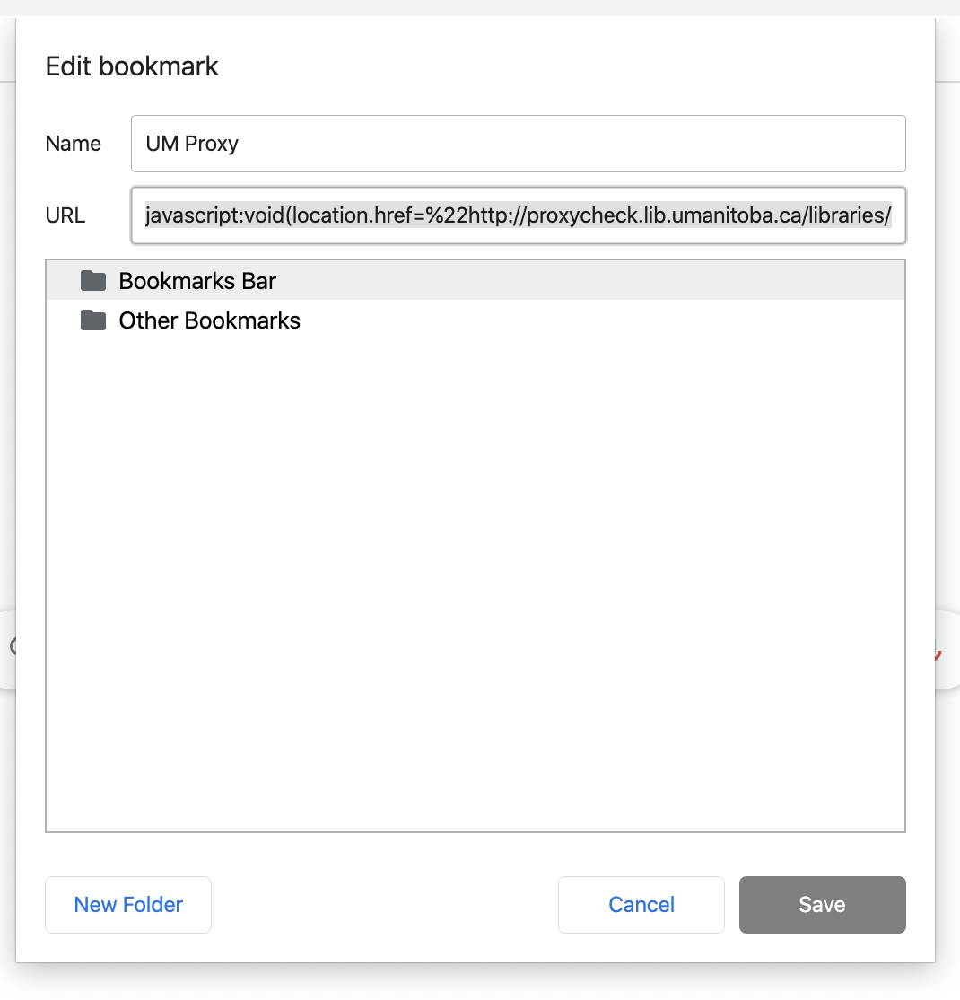

# Starting Your Research

Getting started is not easy if you don't already have a pre-determined problem you are trying to solve. The idea, scope, and even the topic may change through out your journey here in the lab. This section will provide you some helpful tips on how to get started.

## Quick Links
* [You and Your Research by Hamming](https://www.youtube.com/watch?v=a1zDuOPkMSw)
* [Ethics](research/ethics)
* [Study Design](research/studydesign)
* [Google Scholar](https://scholar.google.ca/)
* You can drag and drop this to your bookmarks bar:
    * [UMProxy](javascript:void(location.href=%22http://proxycheck.lib.umanitoba.ca/libraries/online/proxy.php?%22+location.href);)


## Defining a Problem

It is recommended to watch [Dr. Richard Hamming's lecture]((https://www.youtube.com/watch?v=a1zDuOPkMSw) to help you start thinking about your research. If you have done previous research, you can try to leverage the results to help design some possible project ideas. Once you have a few ideas, prepare a few slides and prepare to present it Dr. Irani, be also prepared to discuss your problem and potential solutions. If you are stuck on an idea, try doing some literature review, or discuss amongst your colleagues.

## Literature Review

It is important to learn how to navigate Google Scholar, ACM and IEEExplore libraries, and other libraries to access/download articles and papers for your projects. 

### UManitoba Proxy Bookmarklet

This is one of the most powerful tools you have access to. With it, you have off-campus access to many publication libraries such as ACM Digital library and IEEExplore. Further, if you use it during a Google Scholar search, the PDFs for certain papers will appear as well! 

To use it, you can drag and drop this link on to your Bookmarks bar: [UMProxy](javascript:void(location.href=%22http://proxycheck.lib.umanitoba.ca/libraries/online/proxy.php?%22+location.href);) or create a new bookmark on the browser you are using and copy and paste the following into the URL field:

```
javascript:void(location.href=%22http://proxycheck.lib.umanitoba.ca/libraries/online/proxy.php?%22+location.href);
```

ie. 

## Where to next?

Once you've gotten the hang of reviewing literature and a project to start working on there are a few required tasks you are required to do prior to designing and running studies for your project.

### Thesis
Head on over to the [Thesis Program page](research/thesis) for information on how to get started on some tasks that you would need to get done to fully complete your program.

### Ethics
**YOU CANNOT RUN EXPERIMENTS WITHOUT ETHICS!** The [Ethics](research/ethics) section outlines the requirements in order to design and run studies!

### Study Design
The [Study Design](research/studydesign) section guides you through the inital steps of study design as well as has some resources on how to design a study.

### Writing and Presenting
The [Writing and Presenting](research/writing_presenting) section contains resources and tips on writing and presenting research, where to find help, and example presentations.

### Conferences and Publications
The [Conferences and Publications](research/publication) section outlines tips on searching for conferences and where to look for dates.


